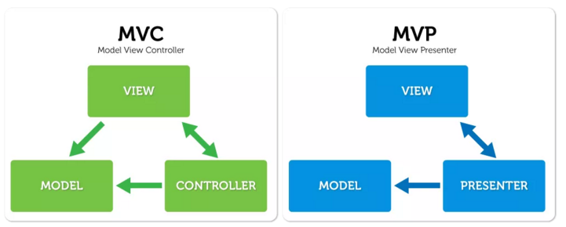

# Android Clean Kotlin 

# Realm

Realm is a mobile database that runs directly inside phones, tablets or wearables.
This repository holds the source code for the Java version of Realm, which currently runs only on Android.

# MVP

The MVP pattern allows separate the presentation layer from the logic, so that everything about how the interface works is separated from how we represent it on screen. 
Ideally the MVP pattern would achieve that same logic might have completely different and interchangeable views.

# The Clean Architecture

Clean Architecture, as mentioned in the provided articles, makes your code:
<ul class="postList"><li name="15f8" id="15f8" class="graf--li graf-after--p"><strong class="markup--strong markup--li-strong">Independent of Frameworks</strong></li><li name="9e4b" id="9e4b" class="graf--li graf-after--li"><strong class="markup--strong markup--li-strong">Testable.</strong></li><li name="8f8e" id="8f8e" class="graf--li graf-after--li"><strong class="markup--strong markup--li-strong">Independent of UI.</strong></li><li name="ae90" id="ae90" class="graf--li graf-after--li"><strong class="markup--strong markup--li-strong">Independent of Database.</strong></li><li name="895e" id="895e" class="graf--li graf-after--li"><strong class="markup--strong markup--li-strong">Independent of any external agency.</strong></li></ul>
